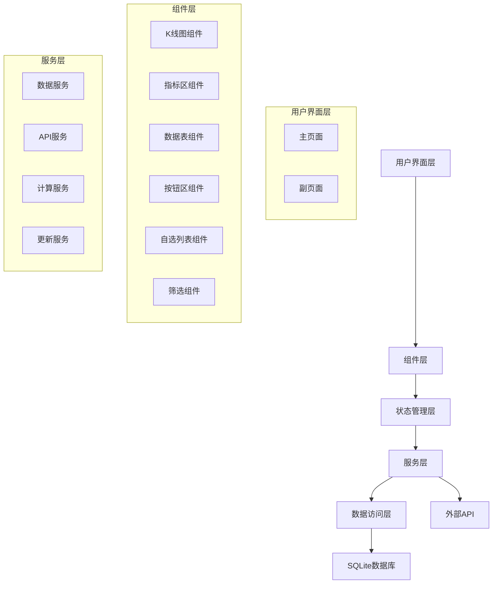

# 设计文档

## 概述

期货席位分析系统采用现代Web技术栈构建，基于React 18 + TypeScript + Vite的前端架构，使用ECharts进行数据可视化，SQLite3作为本地数据存储。系统采用组件化设计，通过状态管理实现数据流控制，支持实时数据更新和复杂的金融指标计算。

## 架构

### 技术栈
- **前端框架**: React 18 + TypeScript
- **构建工具**: Vite
- **状态管理**: Zustand
- **图表库**: ECharts + echarts-for-react
- **样式**: Tailwind CSS
- **路由**: React Router DOM
- **数据库**: SQLite3 (通过Tauri或Electron API)
- **通知**: Sonner

### 系统架构图



## 组件和接口

### 核心组件设计

#### 1. MainLayout 主布局组件
```typescript
interface MainLayoutProps {
  children: React.ReactNode;
}

// 负责整体布局：左列75%（K线区40% + 指标区60%），右列25%（4个区域）
```

#### 2. KLineChart K线图组件
```typescript
interface KLineChartProps {
  commodityId: string;
  data: MarketData[];
  onRightClick: (commodity: string) => void;
  onWheel: (direction: 'up' | 'down') => void;
}

interface MarketData {
  trade_date: string;
  open: number;
  high: number;
  low: number;
  close: number;
  volume: number;
  open_interest: number;
}
```

#### 3. IndicatorArea 指标区组件
```typescript
interface IndicatorAreaProps {
  template: 'template1' | 'template2';
  indicatorType: IndicatorType;
  commodityId: string;
  data: IndicatorData;
}

type IndicatorType = 
  | 'real-long-short' 
  | 'net-long-short' 
  | 'flow-long-short'
  | 'net-position-six'
  | 'trend-six'
  | 'profit-six'
  | 'pie-charts';

interface IndicatorData {
  realLongShort?: RealLongShortData;
  netLongShort?: NetLongShortData;
  flowLongShort?: FlowLongShortData;
  seatCurves?: SeatCurveData[];
  pieCharts?: PieChartData;
}
```

#### 4. HoldingDataTable 持仓数据表组件
```typescript
interface HoldingDataTableProps {
  data: HoldingData[];
  onSeatClick: (seatName: string) => void;
  onSort: (column: string, direction: 'asc' | 'desc') => void;
}

interface HoldingData {
  seat_name: string;
  long_vol: number;
  long_chg: number;
  short_vol: number;
  short_chg: number;
  net_vol: number;
  net_chg: number;
  position_ratio: number;
}
```

#### 5. SeatDataTable 席位数据表组件
```typescript
interface SeatDataTableProps {
  data: SeatData[];
  onSeatClick: (seatName: string) => void;
}

interface SeatData {
  seat_name: string;
  profit_15: number;
  profit_60: number;
  profit_120: number;
  trend_05: number;
  trend_15: number;
  trend_30: number;
}
```

### 状态管理设计

#### 全局状态接口
```typescript
interface AppState {
  // 当前选中的品种
  currentCommodity: string;
  
  // 自选列表
  favorites: string[];
  
  // 指标区状态
  indicatorState: {
    template: 'template1' | 'template2';
    currentIndicator: IndicatorType;
    cycleState: {
      trend: 'trend05' | 'trend15' | 'trend30';
      profit: 'profit15' | 'profit60' | 'profit120';
    };
  };
  
  // 页面状态
  pageState: {
    showSubPage: boolean;
    subPageSize: { width: string; height: string };
  };
  
  // 数据更新状态
  updateState: {
    lastUpdate: Date;
    isUpdating: boolean;
    error: string | null;
  };
  
  // 筛选状态
  filterState: {
    conditions: FilterCondition[];
    results: string[];
  };
}
```

## 数据模型

### 数据库表设计

#### 1. 行情数据表 (market_data)
```sql
CREATE TABLE market_data (
  trade_date TEXT NOT NULL,
  contract_id TEXT NOT NULL,
  secShortName TEXT NOT NULL,
  prev_close REAL,
  prev_settle REAL,
  open REAL,
  high REAL,
  low REAL,
  close REAL,
  settle REAL,
  volume INTEGER,
  turnover REAL,
  open_interest INTEGER,
  is_main BOOLEAN,
  is_continuous BOOLEAN,
  contract_unit INTEGER,
  PRIMARY KEY (trade_date, contract_id)
);
```

#### 2. 席位持仓原始表 (holding_raw)
```sql
CREATE TABLE holding_raw (
  id INTEGER PRIMARY KEY AUTOINCREMENT,
  trade_date TEXT NOT NULL,
  contract_id TEXT NOT NULL,
  secShortName TEXT NOT NULL,
  seat_name TEXT NOT NULL,
  long_vol INTEGER DEFAULT 0,
  short_vol INTEGER DEFAULT 0,
  long_chg INTEGER DEFAULT 0,
  short_chg INTEGER DEFAULT 0,
  UNIQUE (trade_date, contract_id, seat_name)
);
```

#### 3. 加权合约表 (weighted_contracts)
```sql
CREATE TABLE weighted_contracts (
  trade_date TEXT NOT NULL,
  commodity_id TEXT NOT NULL,
  commodity_name TEXT NOT NULL,
  open REAL,
  high REAL,
  low REAL,
  close REAL,
  settle REAL,
  volume INTEGER,
  open_interest INTEGER,
  PRIMARY KEY (trade_date, commodity_id)
);
```

#### 4. 席位分析汇总表 (seat_analysis)
```sql
CREATE TABLE seat_analysis (
  trade_date TEXT NOT NULL,
  commodity_id TEXT NOT NULL,
  commodity_name TEXT NOT NULL,
  seat_name TEXT NOT NULL,
  long_vol INTEGER NOT NULL DEFAULT 0,
  short_vol INTEGER NOT NULL DEFAULT 0,
  long_chg INTEGER NOT NULL DEFAULT 0,
  short_chg INTEGER NOT NULL DEFAULT 0,
  net_vol INTEGER GENERATED ALWAYS AS (long_vol - short_vol) STORED,
  net_chg INTEGER GENERATED ALWAYS AS (long_chg - short_chg) STORED,
  PRIMARY KEY (trade_date, commodity_id, seat_name)
);
```

### 计算模型

#### 1. 加权合约计算
```typescript
interface WeightedContractCalculator {
  calculateWeightedContract(
    contracts: MarketData[], 
    commodityId: string, 
    tradeDate: string
  ): WeightedContract;
}

// 计算公式：
// 总持仓量 = Σ各月份合约持仓量
// 持仓权重 = 合约持仓量 / 总持仓量  
// 加权价格 = Σ(合约价格 × 合约权重)
```

#### 2. 指标计算引擎
```typescript
interface IndicatorCalculator {
  // 实多空指标计算
  calculateRealLongShort(
    holdingData: HoldingRawData[], 
    topN: 10 | 20 | 'all'
  ): RealLongShortIndicator;
  
  // 净多空指标计算
  calculateNetLongShort(
    seatAnalysis: SeatAnalysisData[], 
    topN: 10 | 20 | 'all'
  ): NetLongShortIndicator;
  
  // 流多空指标计算
  calculateFlowLongShort(
    seatAnalysis: SeatAnalysisData[], 
    topN: 10 | 20 | 'all'
  ): FlowLongShortIndicator;
  
  // 趋势指标计算
  calculateTrendIndicator(
    netPositions: number[], 
    period: 5 | 15 | 30
  ): number;
  
  // 盈亏指标计算
  calculateProfitLoss(
    positions: PositionData[], 
    prices: PriceData[], 
    period: 15 | 60 | 120
  ): number;
}
```

## 错误处理

### 错误类型定义
```typescript
enum ErrorType {
  API_ERROR = 'API_ERROR',
  DATABASE_ERROR = 'DATABASE_ERROR',
  CALCULATION_ERROR = 'CALCULATION_ERROR',
  NETWORK_ERROR = 'NETWORK_ERROR',
  DATA_VALIDATION_ERROR = 'DATA_VALIDATION_ERROR'
}

interface AppError {
  type: ErrorType;
  message: string;
  details?: any;
  timestamp: Date;
}
```

### 错误处理策略
1. **API错误**: 显示错误通知，提供重试机制，记录错误日志
2. **数据库错误**: 尝试重新连接，数据备份恢复
3. **计算错误**: 数据验证，异常值处理，降级显示
4. **网络错误**: 离线模式，缓存数据使用
5. **数据验证错误**: 数据清洗，异常标记

### 错误恢复机制
```typescript
interface ErrorRecovery {
  // 自动重试机制
  autoRetry(operation: () => Promise<any>, maxRetries: number): Promise<any>;
  
  // 数据回退机制
  fallbackToCache(key: string): any;
  
  // 错误上报
  reportError(error: AppError): void;
  
  // 用户通知
  notifyUser(error: AppError): void;
}
```

## 测试策略

### 单元测试
- 组件渲染测试
- 状态管理测试  
- 计算函数测试
- API服务测试

### 集成测试
- 组件交互测试
- 数据流测试
- 用户操作流程测试

### 端到端测试
- 完整业务流程测试
- 性能测试
- 兼容性测试

### 测试工具
- **单元测试**: Jest + React Testing Library
- **集成测试**: Cypress
- **性能测试**: Lighthouse
- **代码覆盖率**: Istanbul

## 性能优化

### 前端优化
1. **组件优化**: React.memo, useMemo, useCallback
2. **虚拟滚动**: 大数据表格虚拟化
3. **图表优化**: ECharts数据采样，按需渲染
4. **代码分割**: 路由级别的懒加载
5. **缓存策略**: 计算结果缓存，组件状态缓存

### 数据优化
1. **数据库索引**: 关键字段建立索引
2. **查询优化**: SQL查询优化，分页查询
3. **数据预处理**: 后台计算，结果缓存
4. **增量更新**: 只更新变化的数据
5. **数据压缩**: 历史数据压缩存储

### 内存管理
```typescript
interface MemoryManager {
  // 数据缓存管理
  cacheManager: {
    set(key: string, data: any, ttl?: number): void;
    get(key: string): any;
    clear(pattern?: string): void;
  };
  
  // 组件清理
  componentCleanup: {
    unsubscribe(subscriptions: any[]): void;
    clearTimers(timers: any[]): void;
    releaseResources(): void;
  };
}
```

这个设计文档涵盖了系统的核心架构、组件设计、数据模型、错误处理和性能优化策略，为实现一个高性能、可维护的期货席位分析系统提供了完整的技术方案。