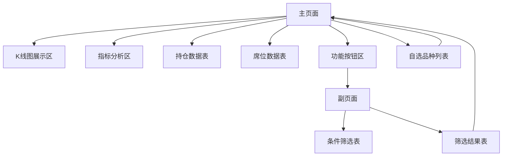

# 席位分析系统产品需求文档

## 1. 产品概述

本系统是基于本地数据库的期货席位分析系统，专注于处理6家期货交易所近120个期货品种的行情数据和席位持仓数据。系统采用本地数据本地显示的架构，支持单用户使用，提供专业的K线图展示、多维度指标分析、席位分析工具和多条件组合筛选功能。

系统旨在为期货交易者提供全面的席位持仓分析工具，帮助用户深入了解市场主力资金动向，提升交易决策的准确性。

## 2. 核心功能

### 2.1 用户角色

| 角色 | 注册方式 | 核心权限 |
|------|----------|----------|
| 默认用户 | 无需注册，直接使用 | 可使用所有分析功能，查看所有数据 |

### 2.2 功能模块

我们的席位分析系统包含以下主要页面：

1. **主页面**：K线图展示区、指标分析区、持仓数据表、席位数据表、功能按钮区、自选品种列表
2. **副页面**：条件筛选表、筛选结果表

### 2.3 页面详情

| 页面名称 | 模块名称 | 功能描述 |
|----------|----------|----------|
| 主页面 | K线图展示区 | 显示期货品种K线图，支持阳线红色空心、阴线绿色空心，右键添加自选功能 |
| 主页面 | 指标分析区 | 支持两种模板切换：模板1显示实多空/净多空/流多空指标组，模板2显示净持六/趋势六/盈亏六/饼图二指标组 |
| 主页面 | 持仓数据表 | 显示席位持仓数据：席位名称、多头持仓、多头增减、空头持仓、空头增减、净持仓量、净持增减、持仓占比 |
| 主页面 | 席位数据表 | 显示席位分析数据：席位简称、盈亏15/60/120、趋势05/15/30，支持排序和筛选 |
| 主页面 | 功能按钮区 | 品种选择器、指标切换按钮（实多空、净多空、流多空、净持六、趋势六、盈亏六、饼图二）、副页面跳转 |
| 主页面 | 自选品种列表 | 管理用户自选的期货品种，支持添加、删除、排序功能 |
| 副页面 | 条件筛选表 | 多条件组合筛选：收盘价条件、实多空条件、净多空条件等9种筛选条件 |
| 副页面 | 筛选结果表 | 显示筛选结果，点击品种可联动更新主页面所有区域 |

## 3. 核心流程

**主要用户操作流程：**

用户进入系统后，首先在主页面查看默认品种的K线图和相关分析数据。用户可以通过品种选择器切换不同期货品种，或通过滚轮在自选列表中切换。在指标分析区，用户可以点击不同按钮查看实多空、净多空、流多空等指标组，或查看净持六、趋势六、盈亏六等席位分析指标。

用户可以右键点击K线图将品种添加到自选列表，也可以在自选列表中管理品种。当需要进行条件筛选时，用户点击副页面按钮，在筛选条件表中设置多个筛选条件，执行筛选后将结果导出到筛选结果表，点击结果中的品种可联动更新主页面。

## 4. 用户界面设计

### 4.1 设计风格

- **主色调**：纯黑色背景（左列），深色系背景（右列）
- **次要色彩**：红色（多头/上涨），绿色（空头/下跌），黄色（中性数据），白色（文字）
- **按钮样式**：现代化扁平设计，多颜色区分不同功能
- **字体**：系统默认字体，16-18px字号
- **布局风格**：Flexbox响应式布局，左右分栏设计
- **图标样式**：简洁线性图标，支持hover效果

### 4.2 页面设计概览

| 页面名称 | 模块名称 | UI元素 |
|----------|----------|--------|
| 主页面 | K线图展示区 | 黑色背景，红绿K线，透明数据窗口，十字光标 |
| 主页面 | 指标分析区 | 分格显示，折线图/柱状图，透明数据窗口，双X轴光标 |
| 主页面 | 持仓数据表 | 8行8列表格，暗褐色表格线，黄色表头，白色数据，支持排序 |
| 主页面 | 席位数据表 | 8行8列表格，暗褐色表格线，黄色表头，白色数据，支持排序 |
| 主页面 | 功能按钮区 | 两行布局，第一行3列控件，第二行7个多色按钮 |
| 主页面 | 自选品种列表 | 8行8列网格，暗褐色表格线，白色文字，支持拖拽排序 |
| 副页面 | 条件筛选表 | 10行6列表格，下拉选择器，选择框，白色文字 |
| 副页面 | 筛选结果表 | 6行6列网格，白色文字，点击联动 |

### 4.3 响应式设计

系统采用桌面优先设计，主页面使用Flexbox实现响应式布局。左右分栏比例为75:25，左列上下分格比例为40:60，右列四格比例为30:30:10:30。副页面尺寸为视口的25%宽度和75%高度，上下分格比例为2:1。系统支持现代浏览器的触控交互优化。